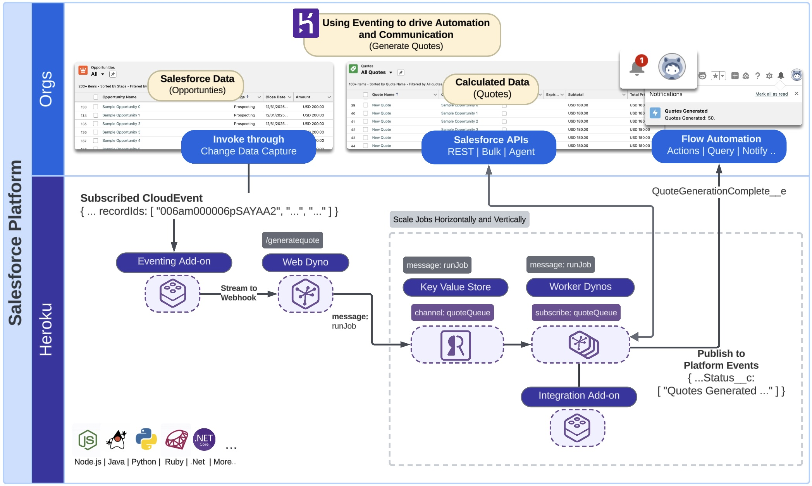
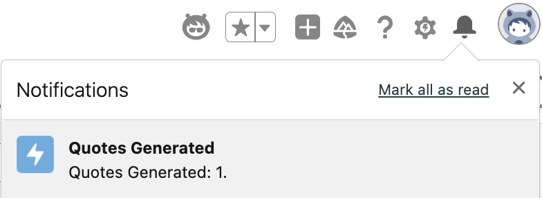
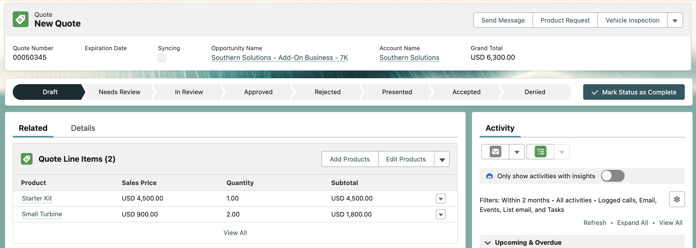
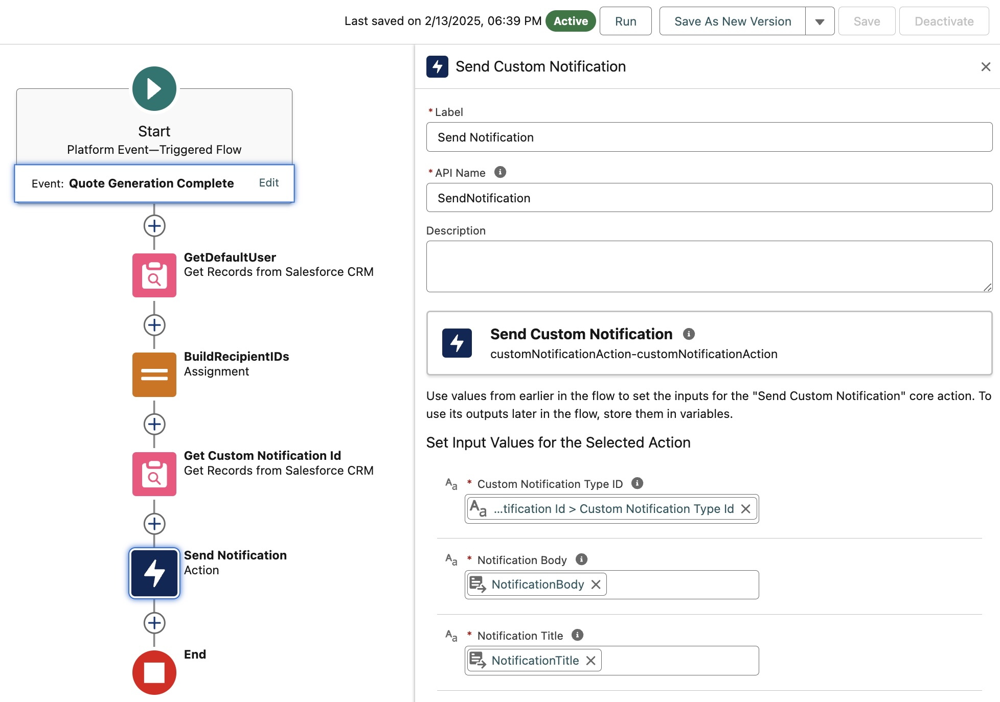
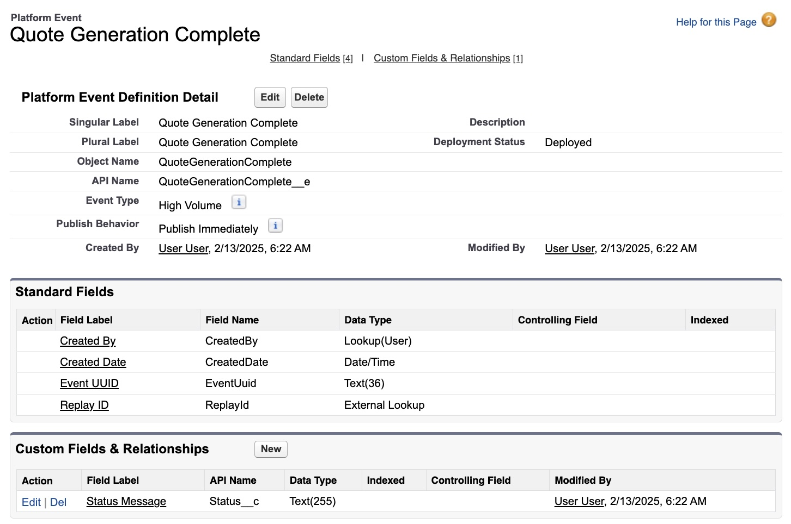
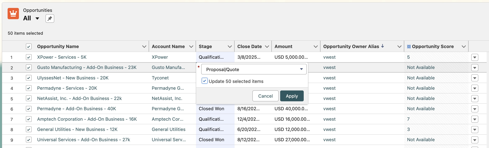
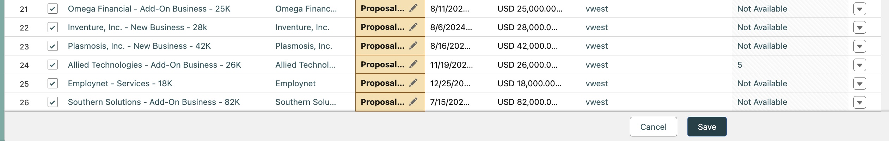
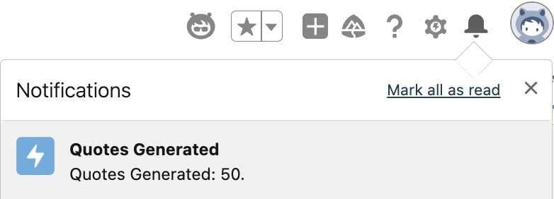

# Heroku Integration - Using Eventing to drive Automation and Communication (Node.js)

> [!IMPORTANT]
> For use with the Heroku Integration and Heroku Eventing pilots only

This sample demonstrates how to use Heroku Eventing to start work and notify users once it completes using [Custom Notifications](https://help.salesforce.com/s/articleView?id=platform.notif_builder_custom.htm&type=5). These notifications are sent to the user's desktop or mobile device running Salesforce Mobile. Flow is used in this sample to demonstrate how processing can be handed off to low-code tools such as Flow. 

# Architecture Overview

The scenario used in this sample illustrates a basis for processing small to large volumes of Salesforce data using elastically scalable Heroku worker processes that execute complex compute calculations based on platform events such as Salesforce CDC events. In this case when **Opportunity** data is updated it is read and calculated pricing data is stored in an associated **Quote**. Calculating quote information from opportunities can become quite intensive, especially when large multinational businessess have complex rules that impact pricing related to region, products, and discount thresholds. It's also possible that such code already exists, and there is a desire to reuse it within a Salesforce context.



This sample uses event based patterns to control processing rather than explicit user invocation to start a bulk job. The result is that work is processed as needed rather than in batch. The choice over streaming execution vs batch execution of your workloads depends on your use case needs, some businesses needs prefer data to change periodically vs ongoing for example financial month end or year end calculations.

Technically speaking, this sample includes two process types `web` and `worker`, both can be scaled vertically and horizontally to speed up processing and response times. The `web` process (`server/index.js` and `server/routes/api.js`) will receive API calls (webhooks for events) from Salesforce and `worker` (`server/worker.js`) will execute the jobs asynchronously. A [Heroku Key Value Store (Redis)](https://elements.heroku.com/addons/heroku-redis) is used to create means to communicate between the two processes (configured in `server/services/redis.js` and `server/config/index.js`). The core pricing and Salesforce interaction logic resides in `server/services/pricingService.js`.

> [!NOTE]
> This sample could be considered an alternative to using Apex Platform Event Subscriptions if your data volumes and/or compute complexity requires it. In addition Heroku worker processes scale elastically and can thus avoid queue wait times impacting processing time that can occur with Batch Apex. For further information see **Technical Information** below.

# Requirements

- Heroku login
- Heroku Integration Pilot enabled
- Heroku Eventing Pilot enabled
- Heroku CLI installed
- Heroku Integration Pilot CLI plugin is installed
- Heroku Eventing Pilot CLI plugin is installed
- Salesforce CLI installed
- Node.js (LTS version recommended, e.g., 20.x or later) and pnpm installed
- Login information for one or more Scratch, Development or Sandbox orgs
- Watch the [Introduction to the Heroku Integration Pilot for Developers](https://www.youtube.com/watch?v=T5kOGNuTCLE) video
- Watch the [Introduction to the Heroku Eventing Pilot for Developers](https://www.youtube.com/watch?v=Pvg1m295WA8) video

# Setting up your Salesforce Org

Steps below leverage the `sf` CLI as well so please ensure you have authenticated your org already - if not you can use this command:

```
sf org login web --alias my-org
```

This sample illustrates passing over processing to a Flow, use the following command to deploy to your Salesforce org:

```
sf project deploy start -o my-org
```

> [!NOTE]
> If you want to skip ahead and know more about what was just deployed see section **Transitioning Processing back to Flow or Apex**.

# Local Development and Testing

This section focuses on how to develop and test locally before deploying to Heroku and testing from within a Salesforce org. Using the `heroku local` command we can easily launch the required processes from one command. The commands in this section allow you to run the sample locally against a remotely provisioned [Heroku Key Value Store](https://devcenter.heroku.com/articles/heroku-redis) and access data within your Salesforce org.

> [!IMPORTANT]
> If have deployed the application, as described below and want to return to local development, you may want to destroy it to avoid race conditions since both will share the same job queue, use `heroku destroy`. In real situation you would have a different queue store for developer vs production.

Even though we are running and testing locally, we will still configure required aspects of the **Heroku Eventing** and **Heroku Integration** add-ons to allow the code to authenticate and interact with your Salesforce Org as it would once deployed. Additionally the Heroku Key Value Store is used to manage a job queue for processing requests sent to the webhook. Start with the following commands to create an empty application, configure the addons and run the sample code locally:

```
heroku create
heroku addons:create heroku-redis:mini --wait
heroku addons:create heroku-integration:test --wait
heroku addons:create herokuevents:test --wait
heroku salesforce:connect my-org --store-as-run-as-user
heroku events:authorizations:salesforce:create my-org
heroku events:publications:salesforce:create QuoteGenerationComplete -t "/event/QuoteGenerationComplete__e" -A my-org
heroku config:set CONNECTION_NAMES=my-org
heroku config --shell > .env
pnpm install
heroku local web=1,worker=1
```

To simulate an event locally we will use a sample of a typical event payload stored in the `opportunity-cdc-event.json` file. Open this file and be sure to edit the `recordIds` value with a valid **Opportunity** Id from your Salesforce org. Note that it is important to anticipate multiple record Ids in one event, as such the code in this sample also considers this.

```
{
    ...
    "specversion":"1.0",
    "subject":"/data/OpportunityChangeEvent",
    ...
    "data":{
        ...
        "ChangeEventHeader":{
            ...
            "recordIds":[
                "001am000019vFalAAE"
            ],
            ...
        },
    ...
}
```

Use the following command to simulate a Salesforce Change Data Capture event being generated from your org and received by a Heroku Eventing subscription which then streams it the web hook this sample code exposes:

```
curl -X POST http://localhost:8080/api/generatequotes \
     -H "Content-Type: application/cloudevents+json" \
     -d @opportunity-cdc-event.json
```

Login to your Salesforce org and you should see a notification as shown below:



> [!NOTE]
> For more information on how the notification above was handled review the next section before deploying.

Observe the logs from the `heroku local` command and you will see the event was received, work put on the queue and executed. (Log output specific to Node.js version will appear here).

Finally you can also observe the **Quote** that was created by navigating to the **Quotes** related list on the **Opportunity** record page and click on the record:



# Transitioning Processing back to Flow or Apex

This sample illustrates how processing can be handed off to Salesforce Flow using Platform Events. This section outlines in further detail how this is done. Earlier in these steps you deployed some metadata to your Salesforce org, as confirmed by the output of the `sf deploy` command:

```
┌───────────┬──────────────────────────────────────┬────────────────────────────┬────────────────────────────────────────────────────────────────────────────────────────────┐
│ State     │ Name                                 │ Type                       │ Path                                                                                       │
├───────────┼──────────────────────────────────────┼────────────────────────────┼────────────────────────────────────────────────────────────────────────────────────────────┤
│ Created   │ QuoteGenerationComplete__e.Status__c │ CustomField                │ src-org/main/default/objects/QuoteGenerationComplete__e/fields/Status__c.field-meta.xml    │
│ Created   │ QuoteGenerationComplete              │ CustomNotificationType     │ src-org/main/default/notificationtypes/QuoteGenerationComplete.notiftype-meta.xml          │
│ Created   │ QuoteGenerationComplete__e           │ CustomObject               │ src-org/main/default/objects/QuoteGenerationComplete__e/QuoteGenerationComplete__e.object- │
│           │                                      │                            │ meta.xml                                                                                   │
│ Created   │ QuoteGenerationComplete              │ Flow                       │ src-org/main/default/flows/QuoteGenerationComplete.flow-meta.xml                           │
│ Created   │ ChangeEvents_OpportunityChangeEvent  │ PlatformEventChannelMember │ src-org/main/default/platformEventChannelMembers/ChangeEvents_OpportunityChangeEvent.platf │
│           │                                      │                            │ ormEventChannelMember-meta.xml                                                             │
└───────────┴──────────────────────────────────────┴────────────────────────────┴────────────────────────────────────────────────────────────────────────────────────────────┘
```

The sample code not only reacts to events from the Salesforce org (Salesforce CDC events) but also sends events as well, such as the `QuoteGenerationComplete__e` event above. This pattern enables the ability to for logic built with Apex or Flow to react or continue with further processing, such as the `QuoteGenerationComplete` flow deployed above.

The Flow is triggered when an event is received on `QuoteGenerationComplete__e` event which sends a [custom notificaiton](https://help.salesforce.com/s/articleView?id=platform.flow_ref_elements_actions_sendcustomnotification.htm&type=5) to the user (as shown above). This is intentionally a simple Flow. Your Flow (or Apex) logic can do updates to other records, send emails, start other Flows or even invokes an Agent!



> [!NOTE]
> In reality you would think carefully about notifications, this sample is illustrative only and would potentially result in a lot of notifications to the user without any kind of filtering or logging elsewhere.

Here is the platform event definition that was deployed to your org:



# Deployment and Bulk Event Testing

> [!IMPORTANT]
> Check you are not still running the application locally. If you want to start over at any time use `heroku destroy` to delete your app.

Create the application and provision the add-ons:

```
heroku create
heroku addons:create heroku-redis:mini --wait
heroku addons:create heroku-integration:test --wait
heroku addons:create herokuevents:test --wait
```

In order to route events to your application the applications public web url is needed, run the `heroku info` command to extract this:

```
Addons:         heroku-integration:test
                heroku-redis:mini
                herokuevents:test
...
Web URL:        https://your-app-name.herokuapp.com/
```

Next ensure that the add-ons are connected to your Salesforce org and that the publications and subscriptions are configured:

> [!IMPORTANT]
> Replace `weburl` below before running the `events:publications:webhook:create` command. For example using the sample `heroku info` output above, the URL would be `https://your-app-name.herokuapp.com/api/generatequotes`

```
heroku salesforce:connect my-org --store-as-run-as-user
heroku events:authorizations:salesforce:create my-org
heroku events:subscriptions:salesforce:create OpportunityChangeEvent -t "/data/OpportunityChangeEvent" -A my-org
heroku events:publications:salesforce:create QuoteGenerationComplete -t "/event/QuoteGenerationComplete__e" -A my-org
heroku events:publications:webhook:create QuoteGenerationWebHook -u "weburl/api/generatequotes" -s OpportunityChangeEvent
heroku config:set CONNECTION_NAMES=my-org
```

Next deploy the application and scale both the `web` and `worker` processes to run on a single dyno each.

```
git push heroku main
heroku ps:scale web=1,worker=1
```

Run the `heroku logs --tail` command to confirm the app is up and running and to monitor the logs as processing takes place.

Now trigger some Salesforce CDC events by making edits to one or more Opportunity records from within Salesforce. Use the **Opportunities** tab and the multi-record edit feature as shown below:




In the above bulk edit 50 Opportunities had been updated, which resulted in a single notification as shown below:



You can also navigate to the **Quotes** tab in your org or one of the sample **Opportunities** to review the generated quotes. You can re-run the above steps as many times as you like it will simply keep adding **Quotes** to the edited Opportunities. It is also worth observing the Heroku logs (Node.js specific logs will appear).

Salesforce transmits a `transactionKey` with each Salesforce CDC event that has been used to buffer events from the same transaction into one job.

# Technical Information

- Events sent to this application do not contain any authentication information. As such the **Heroku Integration** add-on is used above. Notably the `--store-as-run-as-user` CLI parameter is used when connecting the Salesforce org. This allows the worker jobs to request a Salesforce org authentication for their processing using the `@heroku/salesforce-sdk-nodejs` SDK. Note that in contrast with some other patterns, this user is not necessarily the user that triggered the events. It is important to ensure the user used has all the applicable permissions to perform the work required. The Node.js application fetches credentials via an API call to the Heroku Integration service using `HEROKU_INTEGRATION_API_URL` and `HEROKU_INTEGRATION_TOKEN` (these are set by the add-on in Heroku, for local dev they need to be in `.env`).
- Events are not filtered in this sample, so any changes to **Opportunities** result in events triggering **Quote** generation. For example one could configure the subscription to only forward/stream events to the web hook when the `StageName` is of a certain value, e.g. `Proposal/Quote`. For more information see [here](https://devcenter.heroku.com/articles/getting-started-heroku-events#subscribe-to-platform-events-in-salesforce) and [here](https://devcenter.heroku.com/articles/heroku-events-cli#heroku-events-subscriptions-salesforce-create).
- The Node.js application uses Fastify (`server/index.js`) for the `web` process to handle incoming webhook requests efficiently.
- The `web` process (`server/routes/api.js`) implements logic to group CDC events by their `transactionKey` and buffer them in memory until events are received for a different transaction or 15 seconds have passed. The implementation of this approach is not designed for production with multiple web dynos, as it makes assumptions about the processing taking place in only one instance (Dyno) of the web worker. To implement this for production where by multiple web workers might be scaled up, a shared state approach should be used such as Redis to manage the buffer - precise details of this approach is outside the scope of this article. To learn more about `transactionKey` and best practices for handling it refer to [this](https://developer.salesforce.com/docs/atlas.en-us.change_data_capture.meta/change_data_capture/cdc_replication_steps.htm) article.
- The webhook exposed by the `web` process is exposed to the public internet (currently required for Heroku Eventing webhooks) and does not have any authentication applied in this sample. Before deploying to production consider implementing authentication and leverage the `--token` parameter of the `events:publications:webhook:create` command accordingly. See [here](https://devcenter.heroku.com/articles/heroku-events-cli#heroku-events-subscriptions-salesforce-create) for more information.
- The `CONNECTION_NAMES` environment variable is used by this sample to provide the alias of the connected Salesforce org given to the `salesforce:connect` command. This is used by the Heroku Integration API call to specify the target org.
- The `Procfile` defines `web: node server/index.js` and `worker: node server/worker.js`.

## Other Samples

| Sample | What it covers? |
| ------ | --------------- |
| [Salesforce API Access](https://github.com/heroku-examples/heroku-integration-pattern-api-access-nodejs) | This sample application showcases how to extend a Heroku web application by integrating it with Salesforce APIs, enabling seamless data exchange and automation across multiple connected Salesforce orgs. It also includes a demonstration of the Salesforce Bulk API, which is optimized for handling large data volumes efficiently. |
| [Extending Apex, Flow and Agentforce](https://github.com/heroku-examples/heroku-integration-pattern-org-action-nodejs) | This sample demonstrates importing a Heroku application into an org to enable Apex, Flow, and Agentforce to call out to Heroku. For Apex, both synchronous and asynchronous invocation are demonstrated, along with securely elevating Salesforce permissions for processing that requires additional object or field access. |
| [Scaling Batch Jobs with Heroku](https://github.com/heroku-examples/heroku-integration-pattern-org-job-nodejs) | This sample seamlessly delegates the processing of large amounts of data with significant compute requirements to Heroku Worker processes. It also demonstrates the use of the Unit of Work aspect of the SDK (JavaScript only for the pilot) for easier utilization of the Salesforce Composite APIs. |
| [Using Eventing to drive Automation and Communication](https://github.com/heroku-examples/heroku-integration-pattern-eventing-nodejs) | This sample extends the batch job sample by adding the ability to use eventing to start the work and notify users once it completes using Custom Notifications. These notifications are sent to the user's desktop or mobile device running Salesforce Mobile. Flow is used in this sample to demonstrate how processing can be handed off to low-code tools such as Flow. |
